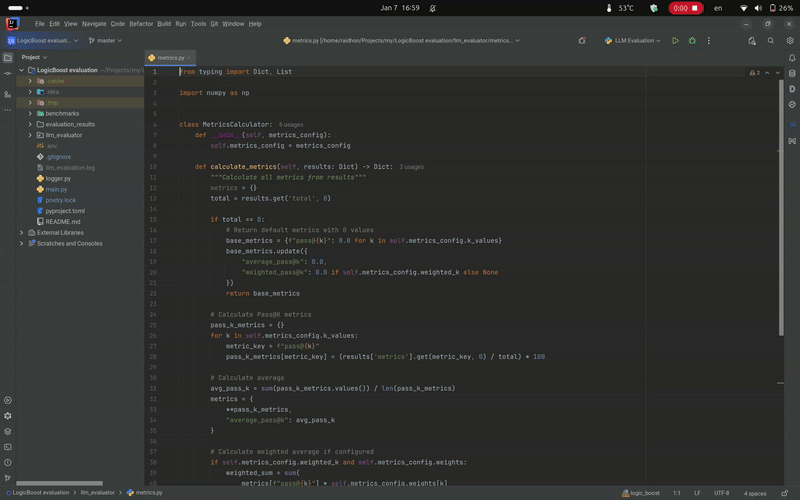

# LogicBoost AI Assistant

A powerful AI coding assistant plugin for JetBrains IDEs that integrates seamlessly with OpenAI-compatible Language Models (LLMs) to enhance your development workflow.



## Features

### 🤖 Multi-LLM Support
- Compatible with OpenAI API and other OpenAI-compatible endpoints
- Flexible configuration for different AI models
- Easy switching between different LLMs

### 💡 Smart Code Understanding
- Context-aware code suggestions
- Intelligent code completion
- Smart debugging assistance
- Code explanation and documentation generation

### 🔧 IDE Integration
- Dedicated tool window for AI interactions
- Right-click context menu integration
- Keyboard shortcuts for quick access
- Seamless theme integration with your IDE

### ⚡ Quick Actions
- **Chat About Selection** (Ctrl+Shift+C): Instantly discuss selected code with AI
- **Add Comment** (Ctrl+Alt+/): Generate intelligent code comments
- Code review suggestions
- Bug detection and fixing recommendations

## Installation

1. Open your JetBrains IDE
2. Go to Settings/Preferences → Plugins
3. Click on "Browse repositories..."
4. Search for "LogicBoost AI Assistant"
5. Click Install
6. Restart your IDE

## Configuration

1. Go to Settings/Preferences → Tools → Logic-Boost
2. Enter your API credentials
3. Configure your preferred LLM endpoint
4. Customize additional settings as needed

## Usage

### Basic Chat
- Open the LogicBoost AI tool window (Right sidebar)
- Type your question or paste code
- Press Enter or click Send

### Code Context Actions
1. Select code in editor
2. Right-click → "Chat About Selection" or use Ctrl+Shift+C
3. Ask questions about the selected code

### Auto-Documentation
1. Select code block
2. Right-click → "Add Comment" or use Ctrl+Alt+/
3. AI will generate appropriate documentation

## Requirements

- JetBrains IDE 2023.1 or later
- Java 17 or later
- Active internet connection
- API key for your chosen LLM service

## Building from Source

```bash
./gradlew build
```

## Contributing

We welcome contributions! Please see our [Contributing Guidelines](CONTRIBUTING.md) for details.

## License

This project is licensed under the Apache-2.0 license - see the [LICENSE](LICENSE) file for details.

## Support

- [Report Issues](https://github.com/deadraid/logic-boost-jb-plugin/issues)
- [Documentation](docs/docs.md)

---

Made with ❤️ by LogicBoost
